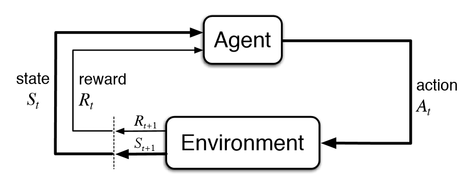

# A markdown file for storing my personal notes for this project. Can be accessed by anyone who is interested in learning this like I am.

# Reinforcement learning - 
A type of machine learning that allows us to make AI agents that learns by the environment it is in by interacting with it in order to maximize its cumulative reward. Basically using trial and error, and incentivizing by rewarding itself for good actions and punishing itself for bad actions.

After each action, the agent recieves feedback. Feedback consists of the reward and next state of the environment.

Reward is defined by human.

# Started with making a Qnetwork class
The QNetwork class is the "brain" of the AI agent. It is a neural network that learns to predict how good each action is in any given situation.

How it works:
Takes in the current state (like the pole's angle and cart position)
Processes it through two hidden layers (the "thinking" part)
Outputs a score for each possible action (left or right)
The agent picks the action with the highest score

Why it matters: Instead of random moves, this network learns from experience which actions lead to keeping the pole balanced. Over time, it gets better at predicting "if I move left now, I'll probably keep the pole up longer" vs "if I move right, the pole will fall."

The forward pass is literally how the brain thinks.
In the simplest terms:

You give it the current situation (pole angle, cart position, etc.) and it spits out two numbers:

Score for moving LEFT
Score for moving RIGHT
The process:

Takes in the game state (4 numbers describing the pole and cart)
Runs it through the first "thinking" layer → applies ReLU (keeps positive signals, zeros out negative)
Runs it through the second "thinking" layer → applies ReLU again
Outputs two final scores
Example:

Input: [cart position: 0.5, cart speed: 0.2, pole angle: 0.1, pole speed: -0.3]
Output: [Left: 2.3, Right: 4.7]
Decision: Pick RIGHT because 4.7 > 2.3

# Replay buffer
Wrote a replay buffer function in utils/reply_buffer.py which stores past experiments in a deque, so AI can learn from them.

Added a push method to store transitions
A transition is one moment of gameplay captured as: "I was in this state, took this action, got this reward, and ended up in this new state."

Added a sample method for batch retieval. 
Instead of learning from experiences one at a time, the AI learns from a random batch (like 32 experiences at once). This method grabs a random sample of past experiences for training.

# DQN Agent setup
Setting up two neural networks (Q-network and Target Network), both identical. The Target Network provides stable learning targets while the Q-Network learns. Without it, learning is unstable.

# Hyperparameters
Epsilon controls exploration → agent tries different things
Replay buffer stores those experiences → agent remembers what happened
Learning rate controls how fast it learns → agent updates its brain
Gamma determines planning horizon → agent thinks about long-term consequences
Epsilon decay shifts from exploring to exploiting → agent gets smarter over time

# epsilon greedy approach
Epsilon-greedy is a simple but powerful strategy that balances exploration vs exploitation:

Generate a random number between 0 and 1
Compare it to epsilon:
If random number < epsilon → Explore (pick random action)
If random number ≥ epsilon → Exploit (pick best action from network)

Example:

Epsilon = 0.8 (80% exploration)
Random number = 0.65
0.65 < 0.8 → Pick random action
Why this works:

Early training: epsilon = 1.0 → always explore (learn about the environment)
Late training: epsilon = 0.05 → mostly exploit (use what you learned)
Always keeps a little randomness to avoid getting stuck

# store transition
This is a simple wrapper method that saves an experience (transition) to the replay buffer. After the agent takes an action in the game, we need to remember what happened so we can learn from it later.

# bellman equation
rewards + self.gamma * next_q_values * (1 - dones)

# epsilon decay
we decay the epsilon as we move forward to have less exploration and more exploitation (working on experience alreayd gathered)

# Performance tracking
CartPole is considered "solved" when you average 195+ reward over 100 consecutive episodes. The deque automatically keeps only the last 100, making this calculation easy.

After each episode (one full game of CartPole), you need to record how well the agent did. This method saves that score in two places:

reward_window - The rolling window (last 100 episodes only)
all_rewards - The complete history (every episode ever)